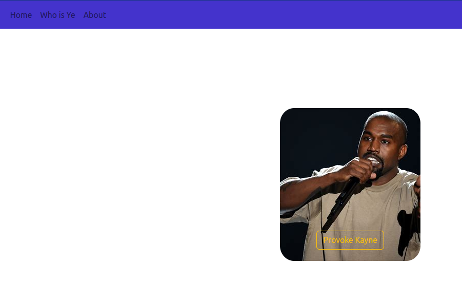

# Kayne Facts

<!---Esses são exemplos. Veja https://shields.io para outras pessoas ou para personalizar este conjunto de escudos. Você pode querer incluir dependências, status do projeto e informações de licença aqui--->




## What is this all about?

Well, this website is meant to be a learning exercise. If you provoke Kayne he will speak
some facts of his own. Be advised, his is ruthless.

To provoke kayne, go to the outlined yellow button just bellow him.

## 💻 Pre-requisites

Verify if you have node installed. If not, checkout these resources:
<!---Estes são apenas requisitos de exemplo. Adicionar, duplicar ou remover conforme necessário--->
* Be sure to have the latest version of [`<Node>`](https://nodejs.dev/en/download/)
* Check out to [`nvm for Windows`](https://github.com/coreybutler/nvm-windows)

## ☕ Using 

To be able to launch:

  > `nmp start` or `npm restart`

The Following messages should appear on your terminal:

```bash
> kayne@0.0.0 restart
> npm stop --if-present && npm start

```

```bash
> kayne@0.0.0 start
> node ./bin/www

```
Type this URL on the browser:
 > https://localhost:3000

<br><br><br>


# Sobre o que é esse site?

É apenas um exercício de aprendizagem. Se você provocar o Kayne West terá que lidar com seus fatos.
Esteja avisado, ele é impiedoso.

Para provocá-lo vá até o botão de bordas amarelas que fica abaixo dele.

# Português

## 💻 Pré-requisitos

Antes de começar, verifique se você atende aos seguintes requisitos:
<!---Estes são apenas requisitos de exemplo. Adicionar, duplicar ou remover conforme necessário--->
* Você instalou a versão mais recente de [`Node`](https://nodejs.dev/en/download/)
* Veja Também [`nvm for Windows`](https://github.com/coreybutler/nvm-windows)

## ☕ Usando 

Para rodar o site:

  > `nmp start` or `npm restart`

A seguinte mensagem deverá aparecer no terminal:

```bash
> kayne@0.0.0 restart
> npm stop --if-present && npm start

```

```bash
> kayne@0.0.0 start
> node ./bin/www

```
Depois digite a URL no navegador:
 > https://localhost:3000

[⬆ Voltar ao topo](#Kayne)<br>
